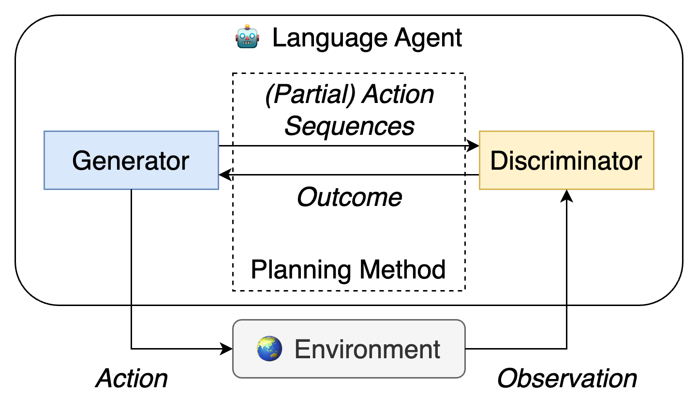

# llm-planning-eval
Code and data for our paper [When is Tree Search Useful for LLM Planning? It Depends on the Discriminator](https://arxiv.org/abs/2402.10890).



#### Updates:

- 02/21/24: We have made the initial release of our code and data. Please feel free to open an issue if you run into any problems. Our release includes:
  - Experimental setup with third-party resources 
  - Data and preprocessing
  - Code for framework and implementation
  - Scripts for intrinsic and end-to-end evaluation

## Table of Contents

1. Installation
2. Experimental Setup
3. Data and Preprocessing
4. Evaluation
5. Citation

## 1 Installation

Please run the following commands to create a conda environment:
```sh
conda env create -f environment.yml
conda activate llm-planning
pip install torch==2.0.1+cu118 torchvision==0.15.2+cu118 torchaudio==2.0.2 --index-url https://download.pytorch.org/whl/cu118
conda install cudatoolkit==11.8.0
```
You may also create two additional folders to avoid potential OS errors:
```sh
mkdir log
mkdir results
```

## 2 Experimental Setup

To run our text-to-SQL parsing experiments, we need to set up some third-party resources.

1. Download the original Spider dataset from this [link](https://drive.google.com/uc?export=download&id=1TqleXec_OykOYFREKKtschzY29dUcVAQ).

2. Clone the Spider evaluation code from this GitHub repository:
```sh
git clone https://github.com/taoyds/test-suite-sql-eval.git
```

3. Download the original Bird dataset from this [website](https://bird-bench.github.io/) and the [evaluation code](https://github.com/AlibabaResearch/DAMO-ConvAI/blob/3c1890d16b775a449ce77736c146adde6dafd45c/bird/llm/src/evaluation.py). Then, reorganize the resources in a folder:
```
├───  bird-sql
│    ├───  databases
│        ├───  ...
│    ├───  dev
│        ├───  ...
│    ├───  train
│        ├───  ...
│    ├───  evaluation.py
```
Note that we merge all train/dev databases into a single `databases` folder, instead of under the `dev` or `train` folder as in the original distribution.

Finally, we put all the directories in parallel:
```
├───  bird-sql
│    ├───  ...
├───  llm-planning-eval
│    ├───  ...
├───  spider
│    ├───  ...
├───  test-suite-sql-eval
│    ├───  ...
```

## 3 Data and Preprocessing

You can find all our preprocessed data at this [link](https://buckeyemailosu-my.sharepoint.com/:u:/g/personal/chen_8336_buckeyemail_osu_edu/ETFggRmzpqpOlbP1Sk7_qYcBtXe-VQaam-ERsOeDwQCryA?e=2UfJuM) and unzip it inside this repository.
```
├───  llm-planning-eval
│    ├───  data
│        ├───  ...
│    ├───  evaluation_configs
│        ├───  ...
│    ├───  ...
```

To preprocess text-to-SQL datasets by yourself, you may refer to the example commands in `scripts/preproc/`. It may take some time depending on how fast your machine can process (large) databases.

For GSM8K, we simply extracted the numerical answers at the end of each annotated solution without any other preprocessing.

## 4 Evaluation

We include example scripts for all our experiments in `scripts/`. The LoRA weights of our fine-tuned LLMs can be accessed [here](https://buckeyemailosu-my.sharepoint.com/:f:/g/personal/chen_8336_buckeyemail_osu_edu/Et4r77yq4WJIjaSHfh-D1mEBZDpGA69KWvQZqizBD7_tBQ?e=RcHN5S).

## 5 Citation
Please cite our paper with the following bibtex:
```
@misc{chen2024tree,
      title={When is Tree Search Useful for LLM Planning? It Depends on the Discriminator}, 
      author={Ziru Chen and Michael White and Raymond Mooney and Ali Payani and Yu Su and Huan Sun},
      year={2024},
      eprint={2402.10890},
      archivePrefix={arXiv},
      primaryClass={cs.CL}
}
```

If used, please also cite the original datasets and evaluation methods accordingly:
```
@inproceedings{yu-etal-2018-spider,
    title = "{S}pider: A Large-Scale Human-Labeled Dataset for Complex and Cross-Domain Semantic Parsing and Text-to-{SQL} Task",
    author = "Yu, Tao  and
      Zhang, Rui  and
      Yang, Kai  and
      Yasunaga, Michihiro  and
      Wang, Dongxu  and
      Li, Zifan  and
      Ma, James  and
      Li, Irene  and
      Yao, Qingning  and
      Roman, Shanelle  and
      Zhang, Zilin  and
      Radev, Dragomir",
    editor = "Riloff, Ellen  and
      Chiang, David  and
      Hockenmaier, Julia  and
      Tsujii, Jun{'}ichi",
    booktitle = "Proceedings of the 2018 Conference on Empirical Methods in Natural Language Processing",
    month = oct # "-" # nov,
    year = "2018",
    address = "Brussels, Belgium",
    publisher = "Association for Computational Linguistics",
    url = "https://aclanthology.org/D18-1425",
    doi = "10.18653/v1/D18-1425",
    pages = "3911--3921",
}
```

```
@inproceedings{zhong-etal-2020-semantic,
    title = "Semantic Evaluation for Text-to-{SQL} with Distilled Test Suites",
    author = "Zhong, Ruiqi  and
      Yu, Tao  and
      Klein, Dan",
    editor = "Webber, Bonnie  and
      Cohn, Trevor  and
      He, Yulan  and
      Liu, Yang",
    booktitle = "Proceedings of the 2020 Conference on Empirical Methods in Natural Language Processing (EMNLP)",
    month = nov,
    year = "2020",
    address = "Online",
    publisher = "Association for Computational Linguistics",
    url = "https://aclanthology.org/2020.emnlp-main.29",
    doi = "10.18653/v1/2020.emnlp-main.29",
    pages = "396--411",
}
```

```
@inproceedings{li2023can,
title={Can {LLM} Already Serve as A Database Interface? A {BI}g Bench for Large-Scale Database Grounded Text-to-{SQL}s},
author={Jinyang Li and Binyuan Hui and GE QU and Jiaxi Yang and Binhua Li and Bowen Li and Bailin Wang and Bowen Qin and Ruiying Geng and Nan Huo and Xuanhe Zhou and Chenhao Ma and Guoliang Li and Kevin Chang and Fei Huang and Reynold Cheng and Yongbin Li},
booktitle={Thirty-seventh Conference on Neural Information Processing Systems Datasets and Benchmarks Track},
year={2023},
url={https://openreview.net/forum?id=dI4wzAE6uV}
}
```

```
@misc{cobbe2021gsm8k,
      title={Training Verifiers to Solve Math Word Problems}, 
      author={Karl Cobbe and Vineet Kosaraju and Mohammad Bavarian and Mark Chen and Heewoo Jun and Lukasz Kaiser and Matthias Plappert and Jerry Tworek and Jacob Hilton and Reiichiro Nakano and Christopher Hesse and John Schulman},
      year={2021},
      eprint={2110.14168},
      archivePrefix={arXiv},
      primaryClass={cs.LG}
}
```